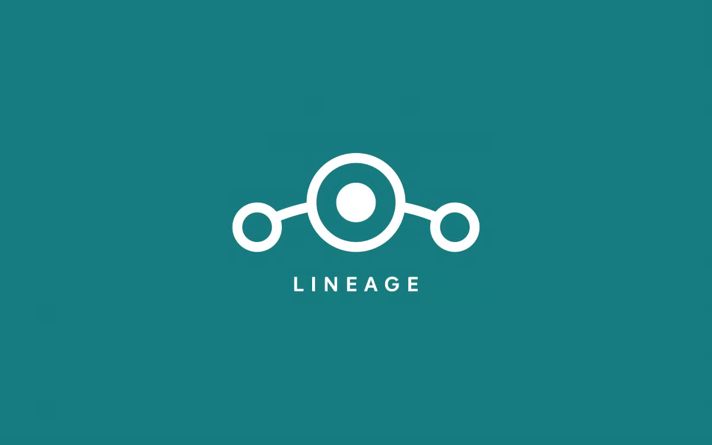

<div align="center">
  
  <h1>MyLineage Dashboard</h1>
  <p><strong>A modern, sleek, and native dashboard app designed for LineageOS users.</strong></p>

  <p>
	
	
	
  </p>
</div>

## 📱 About The Project

**MyLineage** is an open-source, unofficial companion app for LineageOS. It provides a centralized hub to monitor your device's hardware statistics, read the latest official news, and explore the complete database of officially supported LineageOS devices.

Built entirely from scratch using modern Android development practices (Kotlin + Jetpack Compose), it features a premium Material You experience with smooth swipeable tabs.

## ✨ Key Features

* 📱 **Live Supported Devices Database:**
    * Connects directly to the official LineageOS `hudson` GitHub repository.
    * Parses and displays over 450+ officially supported devices in real-time.
    * Search, Filter, and Sort (A-Z) functionality. Instantly redirects to the official installation Wiki.
* 📰 **Smart News Feed:**
    * Fetches the official LineageOS RSS feed in the background.
    * Custom native XML DOM parser to bypass bot protections.
    * Categorize posts by Updates or Changelogs.
    * **Bookmarks:** Save your favorite posts to a dedicated local tab.
* 📊 **My Device (Hardware Hub):**
    * Real-time monitoring of Storage, Battery level, and Temperature.
    * Live system Uptime tracker.
    * Automatic detection of your LineageOS firmware and Android API level.
* 🎨 **Premium UI/UX:**
    * Fully built with Jetpack Compose & Material 3.
    * Horizontal Pager for smooth, seamless swiping between tabs.
    * Android 12+ Splash Screen API integration with an animated boot logo.

## 📸 Screenshots

| Supported Devices | Latest News | My Device |
| :---: | :---: | :---: |
|  |  |  |


## 🛠 Tech Stack & Architecture

* **Language:** Kotlin
* **UI Toolkit:** Jetpack Compose
* **Design System:** Material Design 3 (Material You)
* **Concurrency:** Kotlin Coroutines (`Dispatchers.IO` for network requests)
* **Networking:** Native `HttpURLConnection`
* **Data Parsing:** Native Android XML DOM Parser & `org.json`

## 🚀 Building from Source

To build this project locally, ensure you have **Android Studio** installed.

1. Clone the repository:
   ```bash
   git clone https://github.com/Fr0x1G/MyLineage.git

2. Open the project in Android Studio.
3. Wait for Gradle to sync the dependencies.
4. Hit Run (
   Shift + F10
   ) to install the app on your device or emulator.
   ✏ 📄 License

Distributed under the MIT License. See
LICENSE
for more information.

————————
